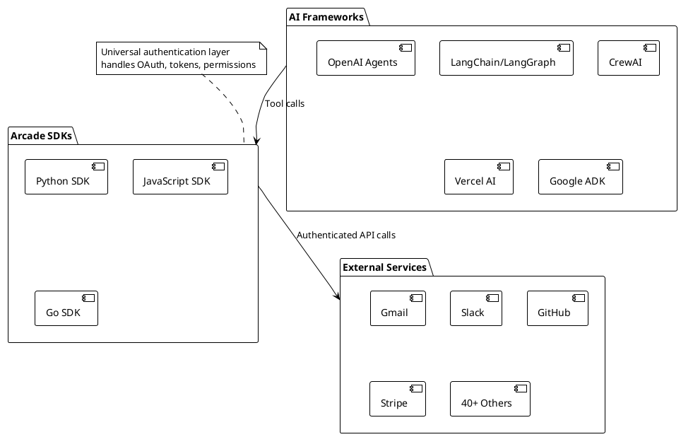
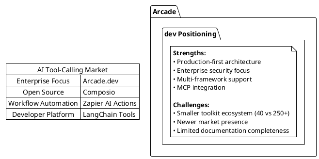

# Arcade.dev: The Authenticated AI Tool-Calling Platform

## Executive Summary

Arcade.dev is an AI infrastructure platform that solves a critical gap in the AI agent ecosystem: **secure, authenticated access to real-world services**. While most AI frameworks excel at prototyping and demos, Arcade provides production-grade authentication and tool execution for AI agents that need to interact with external services on behalf of users.

Think of Arcade as the "authenticated plumbing" between AI agents and the services they need to access - from Gmail and Slack to GitHub and Stripe. It transforms AI agents from conversational tools into action-oriented systems that can perform real work in production environments.

## What Problem Does Arcade Solve?

### The Authentication Gap in AI Agents

Most AI agent frameworks provide tools for accessing external services, but they typically:
- Require developers to build and maintain OAuth flows for each service
- Lack enterprise-grade security and permission management
- Don't handle token refresh and session management
- Provide only demo-quality integrations unsuitable for production

### Real-World Impact

Without Arcade, building a production AI agent that can:
- Send emails on behalf of a user
- Create calendar events
- Manage GitHub repositories
- Process payments through Stripe

...requires months of authentication infrastructure development. With Arcade, this can be accomplished in hours.

## How Arcade Works

<!--
    
```
@startuml firstDiagram
!theme plain

actor User as U
participant "AI Agent" as AI
participant "Arcade Engine" as AE
participant "External Service\n(Gmail, Slack, etc.)" as ES
database "Token Store" as TS

U -> AI: Request action\n"Send email to John"
AI -> AE: Request Gmail.SendEmail tool
AE -> TS: Check user permissions\nfor Gmail
alt User not authenticated
    AE -> U: Generate OAuth link
    U -> ES: Complete OAuth flow
    ES -> AE: Return access tokens
    AE -> TS: Store user tokens
end

AE -> ES: Execute authenticated\nAPI call
ES -> AE: Return result
AE -> AI: Tool execution result
AI -> U: Confirm email sent

note right of AE
  Arcade handles:
  - Token management
  - Permission checking
  - API authentication
  - Error handling
end note

@enduml
```
-->


## Core Architecture

Arcade consists of three main components:

### 1. Authentication Layer
- **OAuth 2.0 flows** for 40+ services
- **Automatic token refresh** and session management
- **Permission-based access control** with user-specific scoping
- **Enterprise security** with VPC deployment options

### 2. Tool Registry
- **40+ pre-built toolkits** covering major SaaS platforms
- **250+ individual tools** for specific operations
- **Consistent API interface** across all services
- **Framework-agnostic** tool definitions

### 3. Execution Engine
- **Secure tool execution** with proper authentication
- **Error handling and retry logic**
- **Real-time permission management**
- **Usage monitoring and analytics**

## Available Toolkits and Their Capabilities

### Productivity and Communication (Strong Coverage)

| Toolkit | Tools | Key Capabilities | Critical Gaps |
|---------|-------|-----------------|---------------|
| **Gmail** | 12 | Email CRUD, drafts, search, threads | No attachment handling, bulk operations |
| **Google Calendar** | 6 | Event CRUD, scheduling assistance | No recurring events, resource booking |
| **Slack** | 7 | Messaging, user management, channels | No file uploads, workflow automation |
| **Notion** | 7 | Page management, search, content | No database manipulation |

### Developer Tools (Limited Coverage)

| Toolkit | Tools | Key Capabilities | Critical Gaps |
|---------|-------|-----------------|---------------|
| **GitHub** | 15+ | Issues, PRs, comments, stars | **No CreatePullRequest**, no repo management |
| **Jira** | Multiple | Issue tracking, project management | Limited advanced project features |

### File Storage (Severely Limited)

| Toolkit | Tools | Key Capabilities | Critical Gaps |
|---------|-------|-----------------|---------------|
| **Dropbox** | 3 | Basic file listing, search, download | **No file uploads**, sharing, or collaboration |
| **Google Docs** | 8 | Basic document operations | **Cloud version unavailable**, limited editing |

### Financial Services (Comprehensive)

| Toolkit | Tools | Key Capabilities | Critical Gaps |
|---------|-------|-----------------|---------------|
| **Stripe** | 11+ | Payments, customers, invoices | Limited subscription management |

### Social Media (Basic)

| Toolkit | Tools | Key Capabilities | Critical Gaps |
|---------|-------|-----------------|---------------|
| **LinkedIn** | 1 | Text post creation only | No messaging, connection management |
| **X (Twitter)** | Limited | Basic posting | No advanced engagement features |

## Technical Integration

### Supported Languages and Frameworks



### Quick Start Example

```python
from arcade.client import Arcade

# Initialize with API key
arcade = Arcade(api_key="your_api_key")

# Request a tool (triggers OAuth if needed)
result = arcade.tools.call(
    tool_name="Gmail.SendEmail",
    user_id="user@example.com",
    parameters={
        "to": "recipient@example.com",
        "subject": "Hello from AI Agent",
        "body": "This email was sent by an AI agent!"
    }
)
```

## Deployment Options

### Cloud Service (Recommended)
- **Fully managed** authentication and tool execution
- **Out-of-the-box** OAuth providers for all supported services
- **Automatic scaling** and monitoring
- **Best for**: Most development and production use cases

### Hybrid Deployment
- **Cloud-managed** users and authentication
- **Self-hosted** tool execution for sensitive operations
- **Best for**: Organizations with specific compliance requirements

### On-Premises
- **Complete self-hosting** for maximum control
- **Enterprise VPC** deployment available
- **Best for**: Highly regulated industries

## Competitive Landscape



## Critical Assessment: Where Arcade Falls Short

### Missing Essential Operations

1. **GitHub Toolkit**: No `CreatePullRequest` - arguably the most important GitHub operation for development workflows
2. **Dropbox Toolkit**: No file upload capability makes it nearly unusable
3. **Google Docs**: Unavailable in cloud deployment, severely limiting productivity workflows
4. **LinkedIn**: Only text posting - no messaging or professional networking features

### Fundamental Limitations

1. **Toolkit Depth vs Breadth**: While Arcade covers many services, most toolkits provide only basic operations
2. **No Cross-Service Operations**: Each toolkit operates in isolation with no workflow coordination
3. **Limited Bulk Operations**: Most toolkits lack batch processing capabilities essential for enterprise use
4. **Missing Admin Features**: Few toolkits provide administrative or configuration management tools

### Real-World Development Implications

For the **GitHub Workflow Application** proposed in the requirements:
- **CreatePullRequest is missing** - This makes the entire workflow impossible without custom development
- **No repository cloning/management** - Cannot interact with local git repositories
- **No branch operations** - Cannot create or manage branches

For the **LinkedIn Auto-Response Application**:
- **No message reading capability** - Cannot access inbox messages
- **No message sending** - Cannot respond to recruiters
- **Only text posting available** - Severely limits functionality

## Market Position and Business Model

### Target Market
- **Primary**: Enterprise AI developers building production agents
- **Secondary**: Individual developers needing authenticated tool access
- **Emerging**: Multi-agentic workflow builders

### Revenue Model
- **Freemium approach** with generous development limits
- **Usage-based pricing** for tool executions
- **Enterprise tiers** for VPC/on-premises deployment
- **Professional services** for custom integrations

### Funding and Growth
- **$12M seed funding** (March 2025) led by Laude Ventures
- **Strong technical team** with enterprise software experience
- **Developer-first go-to-market** strategy

## Why Arcade Matters in the AI Ecosystem

### The Authentication Problem is Universal
Every AI agent that needs to interact with real-world services faces the same authentication challenges. Arcade's solution addresses a fundamental infrastructure need.

### Production vs Prototype Gap
Most AI agent frameworks are built for prototyping. Arcade bridges the gap to production deployment with enterprise-grade security and reliability.

### Multi-Framework Compatibility
Unlike framework-specific solutions, Arcade works across the entire AI agent ecosystem, providing a universal authentication layer.

## Recommendations for Usage

### When to Use Arcade
- **Building production AI agents** that need authenticated access to multiple services
- **Enterprise deployments** requiring secure, scalable authentication
- **Multi-framework projects** that need consistent tool interfaces
- **Rapid prototyping** of authenticated AI workflows

### When to Consider Alternatives
- **Simple, single-service integrations** where custom OAuth might be simpler
- **Services requiring deep, specialized operations** not covered by existing toolkits
- **Budget-constrained projects** where usage costs are prohibitive
- **Applications requiring missing critical operations** (like GitHub PR creation)

### Development Strategy
1. **Start with Arcade** for rapid prototyping and basic operations
2. **Identify gaps** in functionality for your specific use case
3. **Supplement with custom tools** using Arcade's auth but custom API calls
4. **Consider toolkit contributions** to fill missing functionality

## Future Outlook

### Arcade's Path Forward
- **Expand toolkit depth** to match competitor breadth
- **Add missing critical operations** like GitHub PR creation
- **Improve documentation** and developer experience
- **Build ecosystem partnerships** with major AI frameworks

### Industry Trends
- **Model Context Protocol (MCP)** adoption will increase demand for authenticated tool calling
- **Enterprise AI agent deployment** will drive security-first solutions
- **Multi-agentic workflows** will require robust inter-service authentication

### The Authentication Infrastructure Race
Arcade is in a race with Composio, Zapier, and others to become the standard authentication layer for AI agents. Success will depend on:
- **Toolkit completeness** and depth of integration
- **Developer experience** and ease of adoption
- **Enterprise features** and security capabilities
- **Ecosystem partnerships** and market presence

## Conclusion

Arcade.dev represents a sophisticated solution to a real infrastructure problem in the AI agent ecosystem. While their toolkit coverage has notable gaps, their production-first approach and enterprise focus position them well for the evolving market.

For developers building AI agents, Arcade provides immediate value for basic authenticated operations across major platforms. However, complex applications will likely require hybrid approaches combining Arcade's authentication infrastructure with custom development for missing functionality.

The platform's success will ultimately depend on how quickly they can close the functionality gaps while maintaining their security and enterprise-readiness advantages. For now, Arcade is best viewed as a powerful foundation that significantly reduces authentication complexity, but one that may require supplementation for comprehensive real-world applications.
