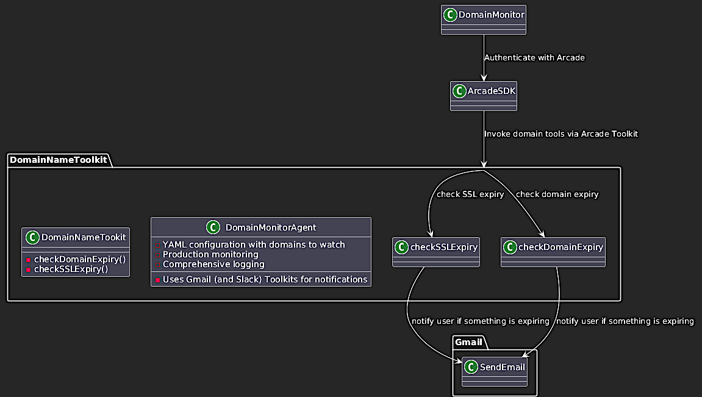
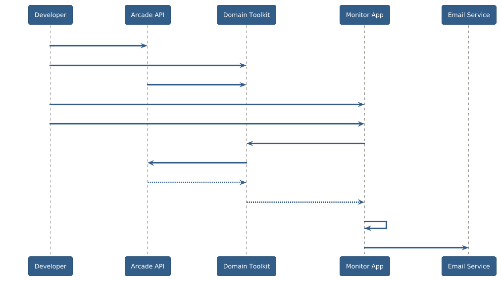

# Arcade Interview Problem

This repository demonstrates a comprehensive implementation of Arcade.dev's toolkit ecosystem through multiple interconnected projects. It serves as both a showcase of Arcade.dev capabilities and a practical domain monitoring solution.

## Project Architecture Overview



## Project Components

This is the top-level of the mono-repo containing several projects, each serving different purposes.

### Core Examples
 * `client_js_setstars/` — JavaScript client demonstrating Arcade.dev's GitHub and Math toolkits
   - Uses `@arcadeai/arcadejs` SDK v1.9.1
   - Implements `Github.SetRepoStars` and `Math.Sqrt` operations
   - Node.js/ES modules implementation with Yarn package management
 * `client_py_getrepo/` — Python client for GitHub repository operations
   - Authenticates against GitHub accounts
   - Retrieves information about `kigster/githuh` repository
   - Demonstrates basic Arcade.dev Python SDK usage
 * `domain_name_toolkit` - the custom toolkit that's been scaffolded using the `arcade new` command and provides two functions: `check_domain_expiry()` and `check_ssl_expiry()` which given a domain determine if the domain and SSL are current, and if they are within 60 days of renewal (configurable).
 * `domain_name_monitor` - a Python app that utilizes the toolkit to perform notifications when a domain expires to a configurable email address.

### Domain Monitoring System Details

The domain monitoring components provide comprehensive functionality:

**Domain Name Toolkit (`domain_name_toolkit/`)**
- Built with Arcade TDK (Toolkit Development Kit) v2.0.0  
- Provides `check_domain_expiry()` and `check_ssl_expiry()` functions
- Configurable alert thresholds (default: 60 days before expiration)
- Includes comprehensive test suite and evaluation framework
- Type-safe implementation with MyPy validation
- Uses python-whois for domain information retrieval

**Domain Monitor Application (`domain_name_monitor/`)**
- YAML-based configuration system (`domain_monitor_config.yaml`)
- Multi-domain monitoring with individual thresholds
- Email notification system with customizable templates  
- JSON result persistence and reporting
- Comprehensive error handling and retry mechanisms
- Currently configured to monitor: kig.re, reinvent.one, re1.re, kig.house

### Supporting Infrastructure
- `doc/img/` — Project documentation images and diagrams (12 images)
- `requirements.txt` — Python dependencies including arcade-ai ≥2.1.4, python-whois, pytest
- `Makefile` — Comprehensive build automation with 47+ targets for testing, linting, deployment
- `worker.toml` — Cloudflare Workers configuration
- `arcade-toolkits-catalog.yaml` — Toolkit catalog definition

## Configuration Management

The domain monitoring system uses a sophisticated YAML configuration with:
- Global alert thresholds (30 days default)
- Per-domain custom thresholds  
- Email notification templates
- Retry and timeout settings
- Logging configuration
- Test domain mocking for development

## Available Make Targets

The project includes comprehensive build automation:
- `make setup` — Complete development environment setup
- `make test` — Run full test suite with coverage
- `make run` — Execute domain monitoring with Arcade integration
- `make run-simple` — Test monitoring without Arcade API
- `make lint` — Code quality checks with ruff
- `make deploy-toolkit` — Deploy custom toolkit to Arcade Cloud

## Running Existing Examples

1. Create an API key here: https://api.arcade.dev/dashboard/api-keys
2. Store it in `.env` file in this project (we alredy have one)
3. If using `direnv` run `direnv allow .` to load the value into the environment.

Verify that `$ARCADE_API_KEY` is set, and if not source `.env` to get it set.

You should be able to execute a command `make run` from the top level `Makefile`, which will then go into each of the following example projects and run them:

 * `client_js_setstars`
 * `client_py_getrepo`

It will run each project by issuing `make run` inside each folder, which should install all the dependencies and execute the calls.

## Development Workflow



## Technology Stack

- **Languages**: JavaScript (Node.js), Python 3.10+
- **Frameworks**: Arcade TDK v2.0.0, @arcadeai/arcadejs v1.9.1  
- **Dependencies**: python-whois, PyYAML, pytest for testing
- **Build Tools**: Make (47+ targets), Yarn for JS package management
- **Configuration**: YAML-based with environment variable support
- **Testing**: Comprehensive pytest suite with mocking and coverage
- **Code Quality**: MyPy type checking, ruff linting and formatting

## Directory Structure

```
arcade-sample-toolkit/
├── client_js_setstars/          # JavaScript Arcade client
│   ├── arcade_repo_set_stars.mjs
│   ├── package.json
│   └── Makefile
├── client_py_getrepo/           # Python Arcade client  
│   ├── arcade_get_repo.py
│   └── Makefile
├── domain_name_toolkit/         # Custom Arcade toolkit
│   ├── domain_name_toolkit/
│   │   └── tools/
│   ├── tests/
│   ├── evals/
│   └── pyproject.toml
├── domain_name_monitor/         # Production monitoring app
│   ├── domain_monitor_app.py
│   ├── config_loader.py
│   ├── domain_monitor_config.yaml
│   └── tests/
├── doc/img/                     # Documentation images
├── requirements.txt             # Python dependencies
├── Makefile                     # Build automation
└── worker.toml                  # Cloudflare Workers config
```

## Few Rules Before We Start

1. Write all markdown documents using professional style and without any emojis ever.
2. If something can be effectively explained by a diagram, please use https://plantuml.com/ to generate a textual diagram and insert it into the markdown (Github supports it). For example, here is a sequential UML diagram: https://plantuml.com/sequence-diagram. 
3. Use UML diagrams as much as makes sense, but remember if a diagram is too complicated it might not be that useful. But for showing movement of data, or authentication process via OATH, those are ideal candidates for the diagrams.

# important-instruction-reminders
Do what has been asked; nothing more, nothing less.
NEVER create files unless they're absolutely necessary for achieving your goal.
ALWAYS prefer editing an existing file to creating a new one.
NEVER proactively create documentation files (*.md) or README files. Only create documentation files if explicitly requested by the User.
