# AI Toolkit and Application Ideas

Based on the available Arcade.dev toolkits and the services you have active accounts with, here are ten creative but practical ideas for custom toolkits and applications, followed by analysis of your proposed ideas.

## Top 10 Creative Ideas

### 1. Smart Meeting Intelligence Platform

**What it does:** An AI assistant that automatically manages your entire meeting lifecycle - from scheduling to follow-up actions.

**Workflow:**

<!--
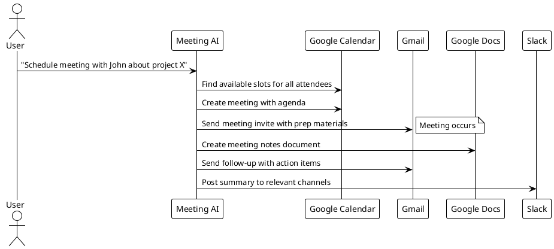
-->

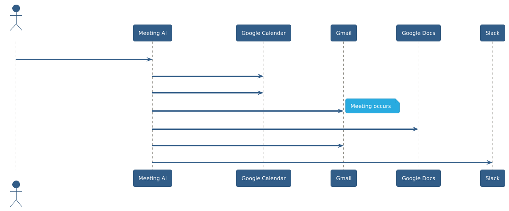

**Third-party services:** Google Calendar, Gmail, Google Docs, Slack
**Custom toolkit needed:** Meeting Intelligence Toolkit
- `AnalyzeMeetingContext()` - Extract topics and participants
- `GenerateAgenda()` - Create structured meeting agenda
- `CreateActionItems()` - Parse meeting content for tasks
- `DistributeFollowup()` - Send personalized follow-ups

**Feasibility:** High - all required Arcade toolkits exist and are comprehensive

---

### 2. Personal Brand Management Suite

**What it does:** Automatically manages your professional presence across LinkedIn, X, and GitHub by analyzing your work and creating relevant content.

**Workflow:**

<!--

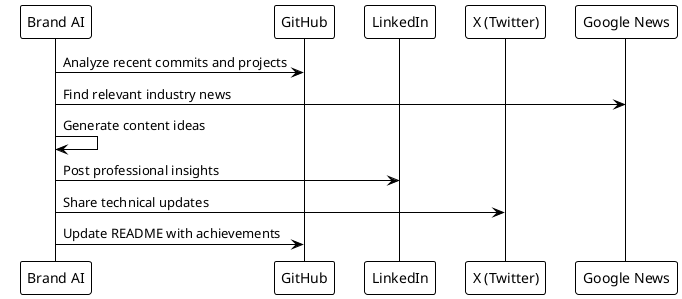
-->

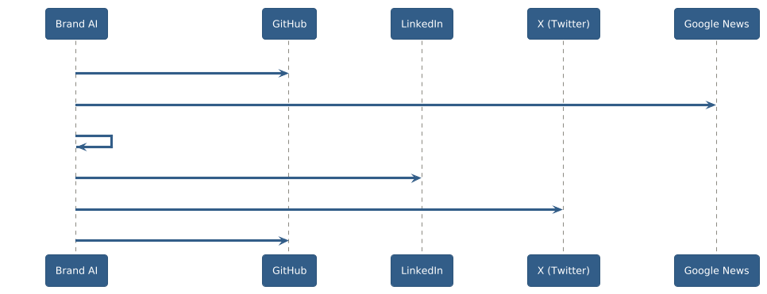

**Third-party services:** GitHub, LinkedIn, X, Google News
**Custom toolkit needed:** Content Intelligence Toolkit
- `AnalyzeCodeActivity()` - Extract insights from commits
- `GenerateContentIdeas()` - Create relevant post topics
- `OptimizePostTiming()` - Find best posting times
- `TrackEngagement()` - Monitor content performance

**Feasibility:** Medium - Limited by LinkedIn (only text posts) and X toolkit capabilities

---

### 3. Intelligent Email-to-Task Orchestrator

**What it does:** Automatically converts emails into actionable tasks across your productivity ecosystem (Notion, Google Calendar, Slack).

**Workflow:**

<!--
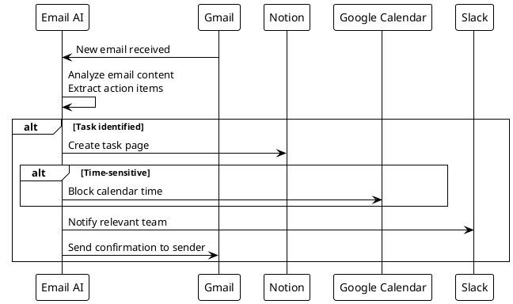
-->

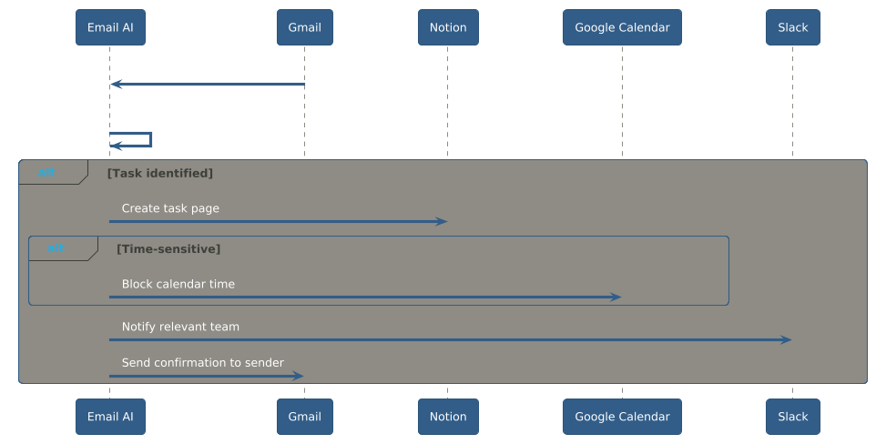

**Third-party services:** Gmail, Notion, Google Calendar, Slack
**Custom toolkit needed:** Email Intelligence Toolkit
- `ClassifyEmailIntent()` - Identify actionable emails
- `ExtractDeadlines()` - Parse dates and urgency
- `AssignCategories()` - Route to appropriate systems
- `GenerateResponses()` - Create acknowledgment emails

**Feasibility:** High - All required toolkits have good coverage

---

### 4. Smart Expense and Receipt Manager

**What it does:** Automatically processes receipts from Gmail, categorizes expenses, and creates reports in Google Sheets while managing reimbursements through Stripe.

**Workflow:**

<!--
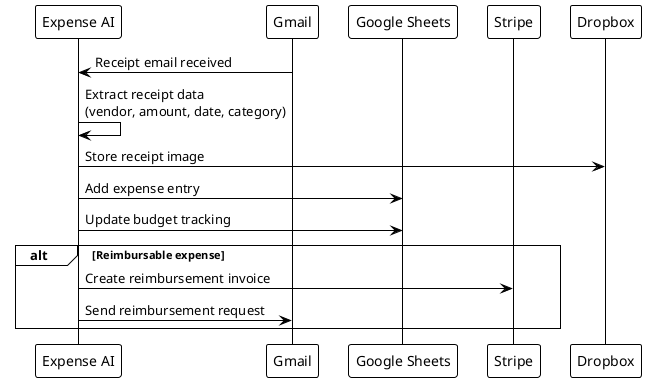
-->

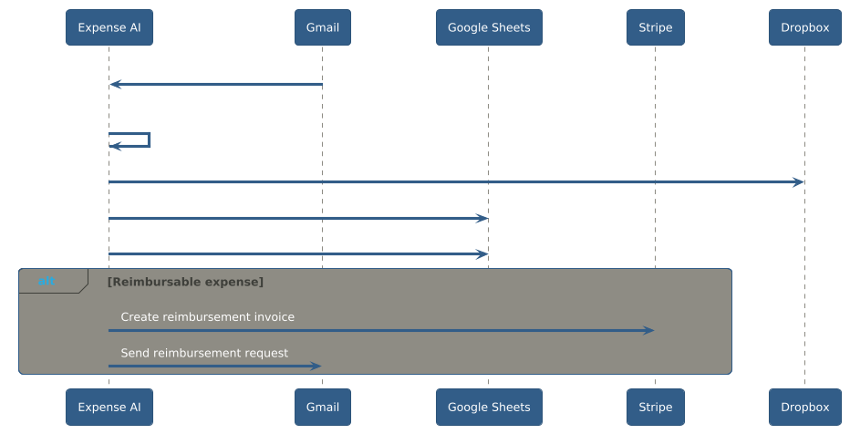

**Third-party services:** Gmail, Google Sheets, Stripe, Dropbox
**Custom toolkit needed:** Expense Intelligence Toolkit
- `ParseReceiptData()` - Extract structured data from receipts
- `CategorizeExpenses()` - Auto-assign expense categories
- `TrackBudgets()` - Monitor spending against budgets
- `GenerateReports()` - Create expense summaries

**Feasibility:** Medium - Limited by Dropbox (no file upload for receipt storage)

---

### 5. Developer Productivity Dashboard

**What it does:** Creates a comprehensive dashboard of your development activity across GitHub, combines it with calendar data to track productivity patterns, and shares insights via Slack.

**Workflow:**

<!--
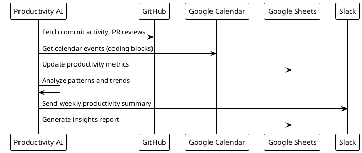
-->

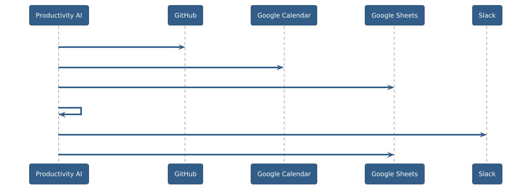

**Third-party services:** GitHub, Google Calendar, Google Sheets, Slack
**Custom toolkit needed:** Developer Analytics Toolkit
- `AnalyzeCommitPatterns()` - Extract coding productivity metrics
- `CorrelateCalendarActivity()` - Match calendar to actual work
- `IdentifyProductivityTrends()` - Find optimal working patterns
- `GenerateInsights()` - Create actionable recommendations

**Feasibility:** High - All required toolkits are well-supported

---

### 6. Intelligent Music-Work Correlation System

**What it does:** Analyzes your Spotify listening patterns against your calendar and productivity metrics to optimize your work environment.

**Workflow:**

<!--
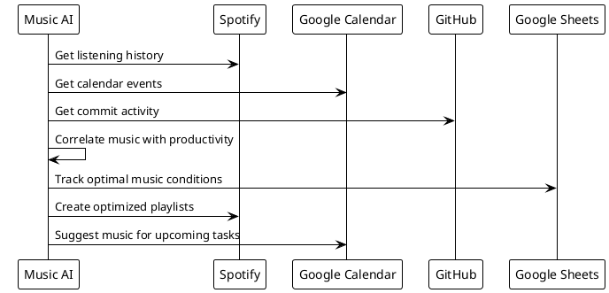
-->

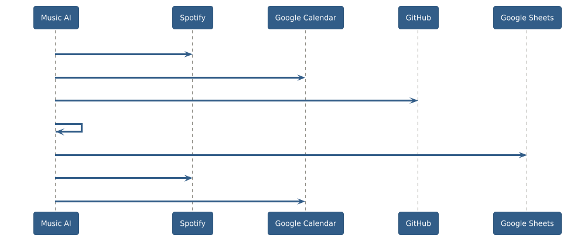

**Third-party services:** Spotify, Google Calendar, GitHub, Google Sheets
**Custom toolkit needed:** Music Intelligence Toolkit
- `AnalyzeListeningPatterns()` - Extract music preferences by context
- `CorrelateMusicProductivity()` - Find music-performance relationships
- `OptimizePlaylists()` - Create task-specific playlists
- `PredictOptimalMusic()` - Suggest music for upcoming work

**Feasibility:** Medium - Depends on Spotify toolkit capabilities (not fully analyzed)

---

### 7. Smart Job Application Assistant

**What it does:** Monitors job postings across multiple platforms, analyzes fit based on your LinkedIn profile, and automatically applies to suitable positions while managing the application pipeline.

**Workflow:**

<!--
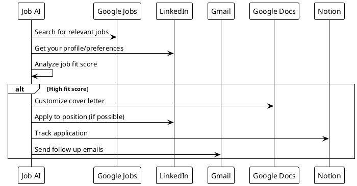
-->

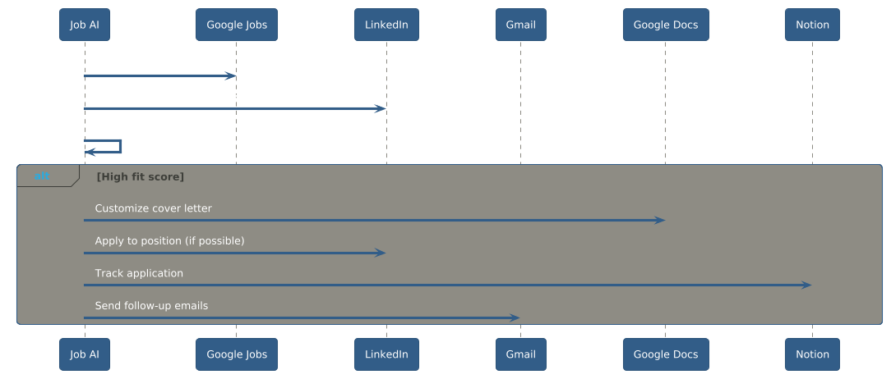

**Third-party services:** Google Jobs, LinkedIn, Gmail, Google Docs, Notion
**Custom toolkit needed:** Job Intelligence Toolkit
- `AnalyzeJobFit()` - Score job opportunities
- `CustomizeCoverLetter()` - Personalize applications
- `TrackApplications()` - Manage application pipeline
- `ScheduleFollowups()` - Automate follow-up communications

**Feasibility:** Low - LinkedIn toolkit too limited for job applications

---

### 8. Smart Home-Office Integration

**What it does:** Integrates your work calendar with smart home systems, automatically optimizing your environment for different types of work.

**Workflow:**

<!--
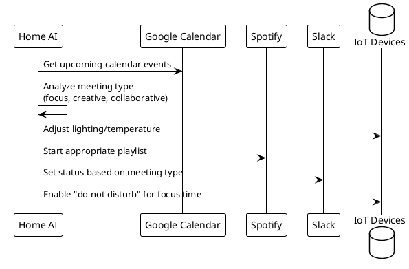
-->

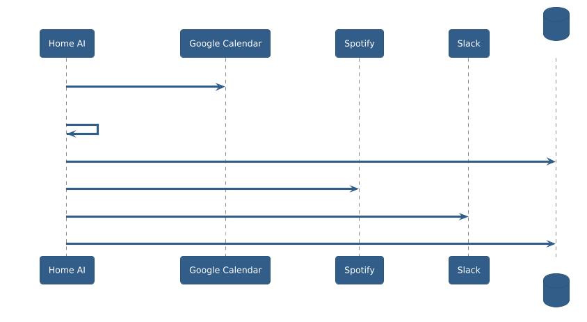

**Third-party services:** Google Calendar, Spotify, Slack
**Custom toolkit needed:** Smart Home Toolkit
- `OptimizeEnvironment()` - Control IoT devices based on work type
- `PredictWorkNeeds()` - Anticipate environmental requirements
- `IntegrateDevices()` - Connect multiple smart home systems
- `CreateWorkProfiles()` - Define optimal settings per work type

**Feasibility:** Low - Requires custom IoT integrations not available in Arcade

---

### 9. Personal Finance Intelligence Platform

**What it does:** Combines data from Stripe (income), Google Sheets (budgeting), Gmail (financial emails), and creates comprehensive financial insights and automated actions.

**Workflow:**

<!--
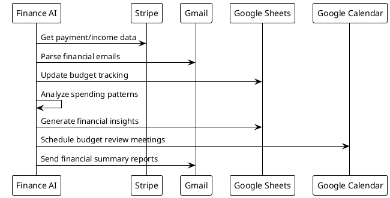
-->

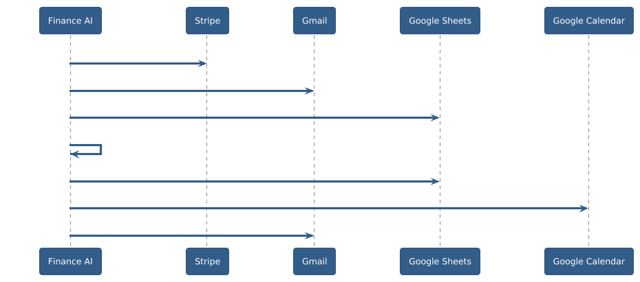

**Third-party services:** Stripe, Gmail, Google Sheets, Google Calendar
**Custom toolkit needed:** Finance Intelligence Toolkit
- `AnalyzeIncomePatterns()` - Track revenue trends
- `CategorizeTransactions()` - Auto-classify expenses
- `PredictCashFlow()` - Forecast financial position
- `GenerateInsights()` - Create actionable financial advice

**Feasibility:** High - All required toolkits well-supported

---

### 10. Research Paper Intelligence Assistant

**What it does:** Monitors academic sources, Reddit discussions, and news for topics relevant to your interests, then creates structured research summaries and shares findings.

**Workflow:**

<!--
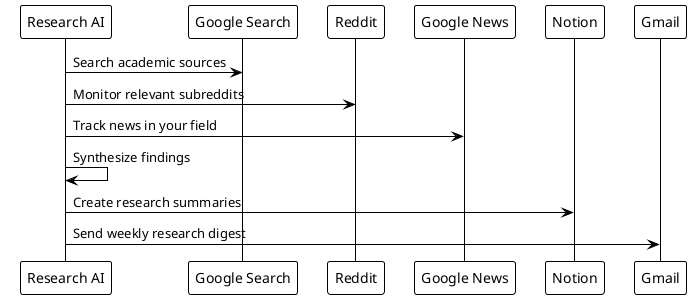
-->

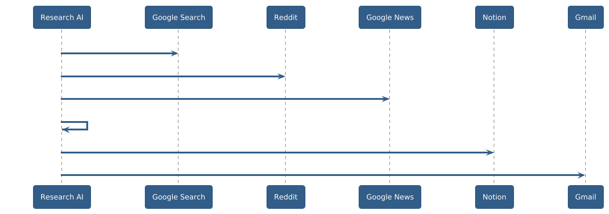

**Third-party services:** Google Search, Reddit, Google News, Notion, Gmail
**Custom toolkit needed:** Research Intelligence Toolkit
- `MonitorSources()` - Track multiple research channels
- `SynthesizeFindings()` - Combine information from multiple sources
- `IdentifyTrends()` - Spot emerging topics
- `CreateSummaries()` - Generate structured research reports

**Feasibility:** High - All required toolkits available and suitable

---

## Analysis of Your Proposed Ideas

### Proposal 1: Analyze Repo & Automatially Generate Github Actions Workflow

**Your Vision:** Automatically detect repositories without CI/CD, fork them, add appropriate GitHub Actions workflows, and create pull requests.

**Feasibility Assessment: LOW**

**Critical Blockers:**
1. **Missing CreatePullRequest**: As identified in our Arcade analysis, this is the most critical missing function
2. **No Repository Management**: Cannot fork repositories or manage branches
3. **No Local Git Operations**: Cannot clone repositories or work with local files
4. **Limited GitHub Toolkit**: Only 15 tools focused on reading/commenting, not creating

**Required Workarounds:**

<!--
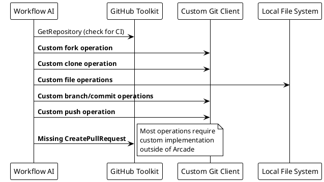
-->

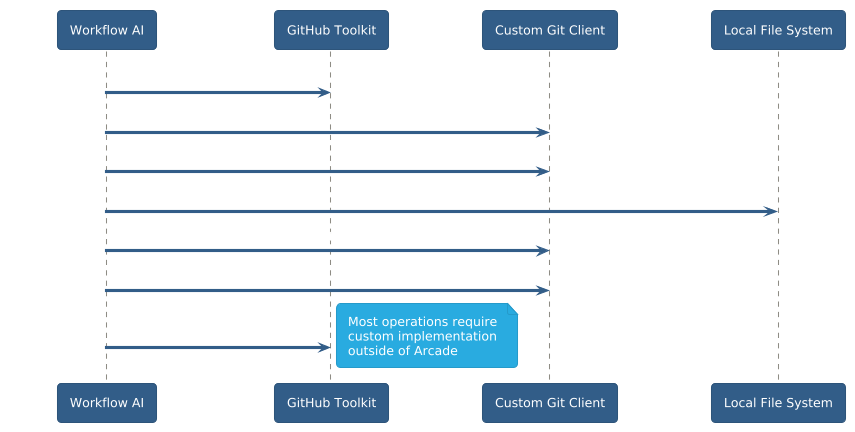

**Alternative Approach:**
- Build a **Custom GitHub Extended Toolkit** that supplements Arcade's GitHub toolkit
- Focus on repositories you own (avoiding fork complexity)
- Use GitHub's REST API directly for missing operations
- Limit scope to adding CI to your own repositories

**Estimated Effort:** High (3-4 weeks) due to extensive custom development needed

---

### Proposal 2: Auto-Answer LinkedIn Messages

**Your Vision:** Automatically read LinkedIn messages, analyze recruiter outreach, and respond appropriately based on your job search status.

**Feasibility Assessment: VERY LOW**

**Critical Blockers:**
1. **LinkedIn Toolkit Severely Limited**: Only 1 tool (CreateTextPost)
2. **No Message Reading**: Cannot access LinkedIn messages/inbox
3. **No Message Sending**: Cannot send direct messages
4. **No Profile Analysis**: Cannot read your own profile for matching

**Current LinkedIn Toolkit Capabilities:**

<!--
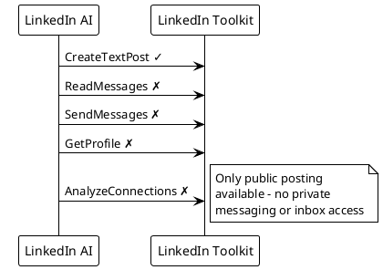
-->

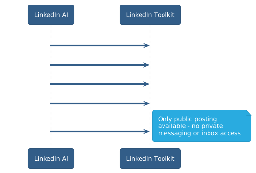

**Required Custom Development:**

- **Complete LinkedIn API Integration**: Build entire messaging system
- **Profile Analysis System**: Custom LinkedIn profile parsing
- **Message Classification**: AI system to identify recruiters vs other messages
- **Response Generation**: Template system with personalization

**Alternative Approach:**
- Build a **LinkedIn Extended Toolkit** with full API integration
- Focus on proactive posting about job search status instead of reactive messaging
- Create a **job search signal system** via posts rather than private responses

**Estimated Effort:** Very High (6-8 weeks) - essentially building a complete LinkedIn automation system

---

## Recommendations

### Most Feasible Ideas (Ranked by Implementation Speed)

1. **Personal Finance Intelligence Platform (#9)** - 1-2 weeks
   - All required toolkits well-supported
   - Clear value proposition
   - Good demonstration of multi-service integration

2. **Intelligent Email-to-Task Orchestrator (#3)** - 2-3 weeks  
   - Leverages strong Gmail, Notion, Calendar toolkits
   - Addresses real productivity pain point
   - Showcases AI decision-making

3. **Smart Meeting Intelligence Platform (#1)** - 2-3 weeks
   - Uses well-supported toolkits
   - High practical value
   - Good workflow complexity

### Most Impressive Ideas (Wow Factor)

1. **Developer Productivity Dashboard (#5)** - Unique insights into coding patterns
2. **Smart Meeting Intelligence Platform (#1)** - Comprehensive meeting automation
3. **Personal Finance Intelligence Platform (#9)** - Actionable financial intelligence

### Recommended Choice: Personal Finance Intelligence Platform

This idea offers the best combination of:

- **High Feasibility**: All required Arcade toolkits are comprehensive
- **Practical Value**: Addresses real financial management needs
- **Technical Interest**: Demonstrates data synthesis across multiple services
- **Quick Implementation**: Can be built in 1-2 weeks
- **Clear Success Metrics**: Easy to measure effectiveness

The application would showcase Arcade's strength in authenticated multi-service orchestration while avoiding the major toolkit limitations that make your proposed ideas challenging to implement.

Would you like to proceed with this recommendation, or would you prefer to tackle one of your original ideas despite the implementation challenges?