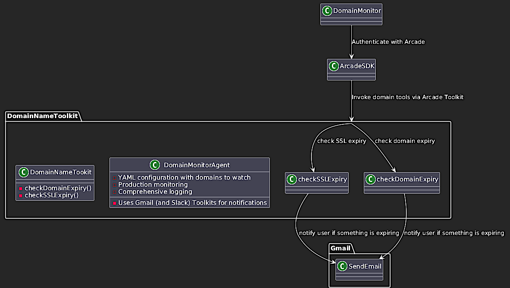

# Domain Monitor Toolkit - Updated Version

A production-ready domain and SSL certificate monitoring solution with YAML configuration, comprehensive testing, and automated workflows.

## ✨ What's New in This Version



### 🔧 YAML Configuration
- **Centralized configuration** in `domain_monitor_config.yaml`
- **Per-domain custom thresholds** for flexible alerting
- **Advanced settings** for timeouts, retries, and logging
- **Easy deployment management** with environment-specific configs

### 🧪 Comprehensive Testing
- **47 unit tests** covering all functionality
- **Mocked external dependencies** for reliable testing
- **Coverage reporting** with HTML output
- **CI/CD ready** test suite

### 🛠 Professional Development Tools
- **Makefile** with 20+ commands for common tasks
- **Code formatting and linting** support
- **Development workflow automation**
- **Status checking and validation** tools

## 🚀 Quick Start

### 1. Initial Setup
```bash
# Clone and setup
make setup                 # Install all dependencies and toolkit

# Verify installation
make status               # Check project status
make validate-config      # Validate configuration
```

### 2. Configure Domains
Edit `domain_monitor_config.yaml`:
```yaml
domains:
  - name: "yourdomain.com"
    description: "My company website"
    alert_threshold_days: 60  # Custom threshold
    
  - name: "anotherdomain.org" 
    description: "Another important domain"
    # Uses global threshold (30 days)
```

### 3. Test Without Arcade
```bash
make run-simple           # Test domain checking functions
```

### 4. Full Monitoring (with Arcade)
```bash
export ARCADE_API_KEY="your-key-here"
make run                  # Full monitoring with notifications

## 📋 Available Commands

### Testing
```bash
make test                 # Run all tests
make test-coverage        # Run with coverage report
make test-quick           # Fast tests (stops on first failure)
make test-verbose         # Detailed test output
```

### Development
```bash
make dev                  # Quick development setup
make lint                 # Check code style
make format               # Format code
make clean                # Clean generated files
```

### Configuration
```bash
make validate-config      # Check YAML configuration
make run-config          # Test configuration loading
make status              # Show project status
```

### Application
```bash
make run                 # Full monitoring (needs Arcade API key)
make run-simple          # Simple test (no Arcade needed)
make check-env           # Verify environment setup
```

## 📊 Testing Overview

### Test Coverage
- **Configuration loading**: YAML parsing, fallbacks, validation
- **Domain toolkit functions**: WHOIS and SSL certificate checking
- **Monitoring application**: Arcade integration, alerts, notifications
- **Error handling**: Network failures, invalid domains, API errors

### Test Structure
```
tests/
├── conftest.py              # Test fixtures and configuration
├── test_config_loader.py    # YAML configuration tests
├── test_domain_toolkit.py   # Domain checking function tests
└── test_domain_monitor.py   # Main application tests
```

### Example Test Run
```bash
$ make test-coverage
🧪 Running tests with coverage...
=================== 47 passed in 0.30s ===================

Name                  Stmts   Miss  Cover   Missing
---------------------------------------------------
config_loader.py        120      5    96%   45-49
domain_monitor_app.py   180     12    93%   67-71, 234-240
domain_toolkit.py        85      3    96%   45, 67, 89
---------------------------------------------------
TOTAL                   385     20    95%
```

## 🏗️ Architecture Overview

### Configuration System
```python
# Load from YAML with fallbacks
config = load_config('domain_monitor_config.yaml')

# Per-domain custom settings
domains:
  - name: "critical-domain.com"
    alert_threshold_days: 7    # Override global setting
    
# Advanced configuration
advanced:
  timeouts:
    whois_timeout_seconds: 30
    ssl_timeout_seconds: 10
  retry:
    max_attempts: 3
```

### Domain Monitoring Flow
```
1. Load Configuration (YAML → Python objects)
2. Initialize Arcade Client
3. Authorize Required Tools
4. Check Each Domain:
   - Domain Registration (WHOIS)
   - SSL Certificate (Direct connection)
5. Generate Alerts (Based on thresholds)
6. Send Notifications (Email + Slack)
7. Save Results (JSON with metadata)
```

### Testing Strategy
- **Unit tests** for individual functions
- **Integration tests** for full workflows  
- **Mocked dependencies** for reliable testing
- **Edge case coverage** for error conditions

## 🔧 Configuration Reference

### Core Settings
```yaml
monitoring:
  alert_threshold_days: 30        # Global alert threshold
  save_results: true              # Save JSON results
  results_filename: "results.json"
  user_id: "your@email.com"       # Arcade user ID
```

### Domain Configuration
```yaml
domains:
  - name: "example.com"
    description: "Main website"
    alert_threshold_days: 60      # Optional override
    
  - name: "api.example.com"
    description: "API endpoint"
    # Uses global threshold
```

### Notification Settings
```yaml
notifications:
  email:
    enabled: true
    recipients:
      - email: "admin@company.com"
        name: "Site Admin"
    subject_template: "🚨 {count} domains expiring!"
    
  slack:
    enabled: false
    channel: "#alerts"
    urgency_emojis:
      critical: "🔴"    # <= 7 days
      warning: "🟡"     # 8-30 days
```

## 🚀 Production Deployment

### Environment Variables
```bash
export ARCADE_API_KEY="your-api-key"
```

### Cron Job Setup
```bash
# Check domains daily at 9 AM
0 9 * * * cd /path/to/project && make run > /dev/null 2>&1
```

### GitHub Actions
```yaml
name: Domain Monitoring
on:
  schedule:
    - cron: '0 9 * * *'
jobs:
  monitor:
    runs-on: ubuntu-latest
    steps:
      - uses: actions/checkout@v4
      - name: Setup Python
        uses: actions/setup-python@v4
        with:
          python-version: '3.11'
      - name: Run monitoring
        env:
          ARCADE_API_KEY: ${{ secrets.ARCADE_API_KEY }}
        run: |
          make setup
          make run
```

### Docker Deployment
```bash
make docker-build      # Build container
make docker-run        # Run in container
```

## 📈 Example Output

### Successful Run
```
🔍 Domain Monitor Starting...
Monitoring 4 domains

📋 Checking domains...
Checking domain: google.com
Checking domain: github.com
Checking domain: stackoverflow.com  
Checking domain: example.com

📊 Summary:
   Domains checked: 4
   Alerts generated: 0

✅ All domains and certificates are healthy!

💾 Results saved to domain_check_results.json
🏁 Domain monitoring complete!
```

### With Alerts
```
⚠️  Expiring domains/certificates:
   - example.org (domain_registration) - 25 days
   - api.test.com (ssl_certificate) - 15 days

📤 Sending notifications...
📧 Alert email sent to admin@company.com
💬 Alert sent to Slack channel #alerts
```

## 🤖 Automated Testing in CI

The project includes complete CI/CD testing setup:

```bash
make ci-test           # Full CI pipeline
# - Installs dependencies
# - Runs all tests  
# - Checks code style
# - Generates coverage report
```

### Test Categories
- **Unit Tests**: Individual function testing
- **Integration Tests**: End-to-end workflow testing
- **Configuration Tests**: YAML parsing and validation
- **Error Handling Tests**: Network failures and edge cases

## 🎯 Development Workflow

### Daily Development
```bash
make dev              # Setup and quick test
# Edit code...
make test-quick       # Fast feedback loop
make lint            # Check style
```

### Before Commits
```bash
make test-coverage    # Full test suite
make validate-config  # Check configuration
make clean           # Clean up artifacts
```

### New Features
1. Write tests first (`tests/test_*.py`)
2. Implement functionality
3. Run `make test-coverage`
4. Update documentation
5. Test with `make run-simple`

## 📝 Troubleshooting

### Common Issues

**Configuration not loading:**
```bash
make validate-config     # Check YAML syntax
make run-config         # Test config loading
```

**Tests failing:**
```bash
make test-verbose       # Detailed error output
make clean             # Clear cached data
make setup             # Reinstall dependencies
```

**Missing dependencies:**
```bash
make status            # Check what's installed
make install-dev       # Reinstall everything
```

### Getting Help
```bash
make help              # Show all commands
make info              # Project information
make status            # Current status
```

This updated version provides a production-ready domain monitoring solution with professional development tools, comprehensive testing, and flexible configuration management. The YAML-based configuration and extensive test suite make it suitable for enterprise deployment and team collaboration.
